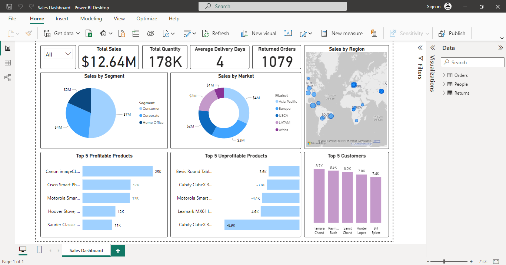

## Power BI Project: Global Superstore Sales Dashboard

### Overview:
In this Power BI project, I leverage datasets from the Global Superstore dataset to create an insightful dashboard providing key metrics and visualizations for business analysis. The dashboard is designed to offer actionable insights into sales performance, customer behavior, and product profitability.

### Tools used:
- Power BI Desktop

### Visualization:
- **Data Overview:**
    - Total Sales (Cards): Sum of all sales revenue.
    - Total Quantity (Cards): Sum of all products sold.
    - Average Delivery Days (Cards): Average time taken for delivery.
    - Returned Orders (Cards): Count of orders that were returned.
- **Customer Segmentation:**
    - Sales by Segment (Pie Chart): Distribution of sales revenue across different customer segments.
- **Market Analysis:**
    - Sales by Market (Donut Chart): Distribution of sales revenue across different markets.
- **Geographic Representation:**
    - Sales by Region (Map): Geographic representation of sales revenue by region.
- **Product Performance:**
    - Top 5 Profitable Products (Horizontal Bar Chart): Visualization of the top 5 products with the highest profit margins.
    - Top 5 Unprofitable Products (Horizontal Bar Chart): Visualization of the top 5 products with the lowest profit margins.
- **Customer Insights:**
    - Top 5 Customers (Vertical Bar Chart): Identification of the top 5 customers with the highest purchase volumes.

### Conclusion:
The Power BI dashboard provides stakeholders with comprehensive insights into sales dynamics, customer behavior, and product performance, facilitating data-driven decision-making. Through analysis of key metrics like total sales, quantity, delivery days, and returned orders, stakeholders can quickly assess performance and identify improvement areas. Visualizations such as pie and donut charts enable segmentation of sales across different customer segments and markets, aiding in targeted marketing strategies. The geographic map highlights regional sales patterns, while horizontal bar charts identify top performing products for strategic analysis. Additionally, the vertical bar chart identifies high-value customers for personalized marketing approaches. Overall, the dashboard equips stakeholders with actionable insights to optimize business strategies and drive sustainable growth in a competitive market landscape.

### Dashboard

